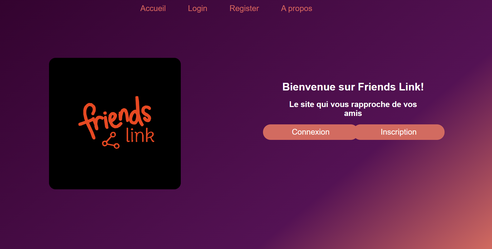
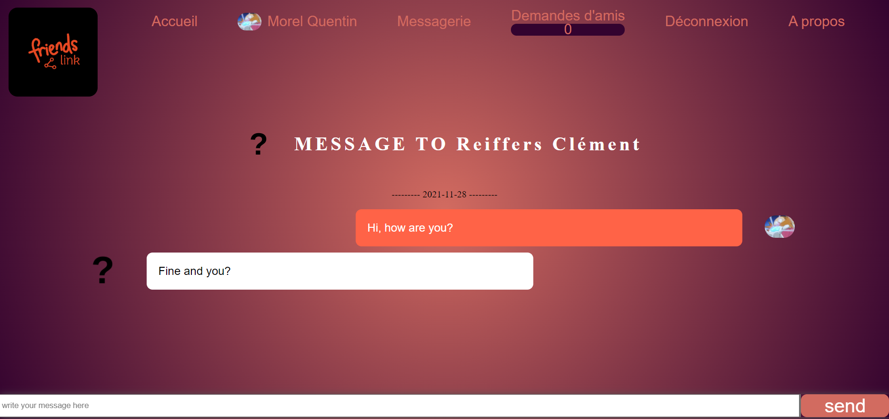

# friends-link

  

  
## Description

  
  
  
  

Social media developed in PHP, HTML, CSS, JavaScript and SQL.  
The website allows you to register and communicate with other persons.  
That can be Direct messages, posts, post comments, searching peoples, create group conversation, modify your homepage.  
The social media is only in French. It is a pure learning exercise.  

## Features

The social media allow you to creat an account and add everyone that is on the platform as a friend with a system of friend request.  
You can then directly speak with them by direct messages.  
friends-link also allow you to create post with pictures with comment under it. A like system is also implemented to increase the spread of a specific post. 

## Screenshots

<!-- | Home page | Chat Page |
| --- | --- |
|  |  | -->

<!-- Home Page -->

  

<!-- Chat page -->

    

<!-- Post Page -->

    <td></td>

## Local servor test

To easily debug our website, we used Xampp that allow us to create a local network handling PHP, HTML, CSS and our SQL database.

Xampp :  
<https://www.apachefriends.org/fr/index.html>

## Web pages validation

All pages of the website are validated byt the W3C validator.  
You can test the good behaviour of all pages with the website link below :  
<https://validator.w3.org>

## Resources

Xampp :  
<https://www.apachefriends.org/fr/index.html>

W3C validator :  
<https://validator.w3.org>

## Contributors

Clément Reiffers :

- @clementreiffers
- <https://github.com/clementreiffers>

Quentin Morel :

- @Im-Rises
- <https://github.com/Im-Rises>

Dorine Brun :

- @dorinebrun
- <https://github.com/dorinebrun>

